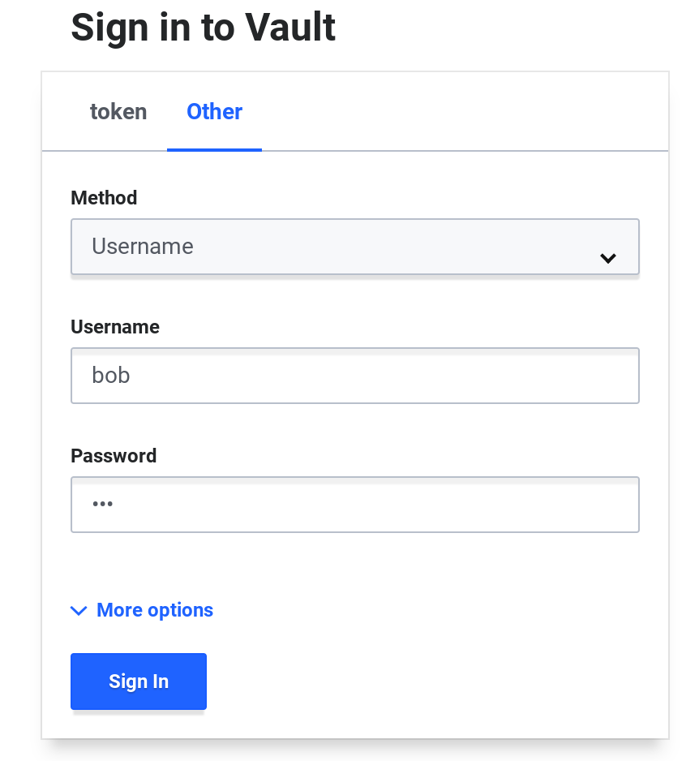
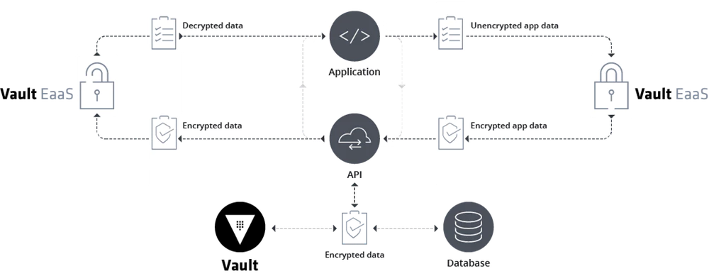

name: chapter-1
class: title, shelf, no-footer, fullbleed
background-image: url(https://hashicorp.github.io/field-workshops-assets/assets/bkgs/HashiCorp-Title-bkg.jpeg)
count: false

# Chapter 1  
## Review Intro to Vault Topics


???
We will quickly review all of the major topics covered in the Intro to Vault course.

---
name: hashiCorp-vault-overview
# HashiCorp Vault Overview


  * HashiCorp Vault is an API-driven, cloud agnostic secrets management system.
  * It allows you to safely store and manage sensitive data in hybrid cloud environments.
  * You can also use Vault to generate dynamic short-lived credentials, or encrypt application data on the fly.

???
This is meant as a high level overview.  For detailed descriptions or instructions please see the docs, API guide, or learning site:
* https://www.vaultproject.io/docs/
* https://www.vaultproject.io/api/
* https://learn.hashicorp.com/vault/

---
name: the-old-way
layout: false
# The Traditional Security Model
.center[]
.center[Also known as the "Castle and Moat" method.]

???
* This picture shows the traditional castle and moat security model.

---
layout: true

.footer[
- Copyright © 2019 HashiCorp
- 
]

---
name: traditional-security-models
# The Traditional Security Model
* Traditional security models were built upon the idea of perimeter based security.
* There would be a firewall, and inside that firewall it was assumed one was safe.
* Resources such as databases were mostly static.  As such rules were based upon IP address, credentials were baked into source code or kept in a static file on disk.

???
This slide discusses the traditional security model

---
name: problems-with-traditional-security-models
# Problems with the Traditional Security Model
* IP Address based rules
* Hardcoded credentials with problems such as:
  * Shared service accounts for apps and users
  * Difficult to rotate, decommission, and determine who has access
  * Revoking compromised credentials could break

???
* This slide describes some of the problems with the traditional security model.
---
name: the-new-way
layout: false
# Modern Secrets Management
.center[]
.center[No well defined perimeter; security enforced by identity.]

???
* These are Mongolian Yurts or "Ger" as they are called locally. Instead of a castle with walls and a drawbridge, a fixed fortress that has an inside and an outside, these people move from place to place, bringing their houses with them.

* And if you don't think the Nomadic way can be an effective security posture, think about this for a moment. The Mongol military tactics and organization enabled the Genghis Khan to conquer nearly all of continental Asia, the Middle East and parts of eastern Europe. Mongol warriors would typically bring three or four horses with them, so they could rotate through the horses and go farther. Mongol army units could move up to 100 miles a day, which was unheard of in the 13th century. They were faster, more adaptable, and more resilient than all their enemies.

---
name: identity-based-security-1
#Identity Based Security
.center[]
.center[[Identity Based Security and Low Trust Networks](https://www.hashicorp.com/identity-based-security-and-low-trust-networks)
]

???
* Here we see that Vault has multiple means of authenticating users and applications with its Auth Methods.
* Vault can manage many types of secrets and excels at generating short-lived, dynmamic secrets.
* Vault's ACL policies are associated with tokens that users and applications use to access secrets after authenticating.
* Tokens can only read/write secrets that its policies allow.
* Click on the link to read a white paper about identity-based security in low trust networks.

---
layout: true

.footer[
- Copyright © 2019 HashiCorp
- 
]

---
name: identity-based-security-2
# Identity Based Security

Vault was designed to address the security needs of modern applications.  It differs from the traditional approach by using:

* Identity based rules allowing security to stretch across network perimeters
* Dynamic, short lived credentials that are rotated frequently
* Individual accounts to maintain provenance (tie action back to entity)
* Credentials and Entities that can easily be invalidated

???
* This slide discusses how Vault is designed for modern applications.

---
name: secrets-engines
layout: false
# Vault Secrets Engines
.center[]
.center[[Vault Secrets Engines](https://www.vaultproject.io/docs/secrets/index.html)]

???
* Vault provides many out-of-the-box secrets engines.
* Additional custom secrets engines can be added by customers.
* Click on the link to learn more about Vault secrets engines.

---
name: vault-reference-architecture-1
# Vault Architecture Internals
.center[]
.center[[HashiCorp Vault Internals Architecture](https://www.vaultproject.io/docs/internals/architecture.html)
]

???
* Click the link to learn more about the internal's of Vault's architecture.

---
name: vault-reference-architecture-2
# Vault Architecture - High Availability
.center[]
.center[[Vault High Availability](https://www.vaultproject.io/docs/concepts/ha.html)
]

???
* Vault allows multiple servers to be combined in a highly available cluster within a single cloud region or physical data center.
* Click on the link to learn more about Vault's high availability in a single cluster.

---
name: vault-reference-architecture-3
# Vault Architecture - Multi-Region
.center[]
.center[[Vault Enterprise Replication](https://www.vaultproject.io/docs/enterprise/replication/index.html)
]

???
* Vault Enterprise supports replication between clusters across regions and data centers.
* It supports Disaster Recovery and Performance replication.
* These can be used together.
* Click the link to learn more about Vault's replication.

---
layout: true

.footer[
- Copyright © 2019 HashiCorp
- 
]

---
name: Interacting-With-Vault
# Interacting With Vault

Vault provides several mechanisms for interacting with it:
* The Vault [CLI](https://www.vaultproject.io/docs/commands/index.html)
* The Vault [UI](https://learn.hashicorp.com/vault/getting-started/ui)
* The Vault [API](https://www.vaultproject.io/api/overview)

???


---
name: Vault-CLI
# The Vault CLI
* The Vault CLI is a Go application.
* It runs on macOS, Windows, Linux, and other operating systems.
* You can download the latest version [here](https://www.vaultproject.io/downloads.html).

???
* The Vault CLI is distributed as a Go binary.
* It runs on multiple operating systems.

---
name: some-cli-commands
# Some Basic Vault CLI Commands
* `vault` by itself will give you a list of many Vault CLI commands.
  * The list starts with the most common ones.
* `vault version` tells you the version of Vault you are running.
* `vault read` is used to read secrets from Vault.
* `vault write` is used to write secrets to Vault.

The `-h`, `-help`, and `--help` flags can be added to get help for any Vault CLI command.

???
Let's discuss some of the basic Vault CLI commands.

---
name: vault-server-modes
# Vault Server Modes
Vault servers can be run in two different modes:
* "Dev" mode that is only intended for development
* "Prod" mode that can be used in QA and production

???
* Discuss Vault's two server modes

---
name: vault-dev-server
# Vault's "Dev" Mode
* It is not secure.
* It stores everything in memory.
* Vault is automatically unsealed.
* The root token can be specified before launching.

**Please never store actual secrets on a server run in "Dev" mode.**

???
* Discuss limitations of Vault's "Dev" mode.
* Warn students to never store real secrets on a Dev server.

---
name: Vault-UI
# The Vault UI
* In order to use the Vault UI, you must sign in.
* Vault supports multiple authentication methods.
* A new Vault server will only have the Token auth method enabled.
* In the challenge you just completed, you used the Token auth method and specified "root" as the token.

???

* Let's talk about the Vault UI a bit, including ways of signing into it.
* While you used the token "root" in the last challenge, you'll be running a Vault server in "Prod"  mode in the rest of the track and will have to use the token generated when you initialize that server in the next challenge.

---
name: vault-api-1
# The Vault API

* Vault has an HTTP API that you can use to configure Vault and manage your secrets.
* You can check Vault's health with a simple `curl` command followed by `jq` to format the JSON output.

Command:
```bash
curl http://localhost:8200/v1/sys/health | jq
```
???
* Let's talk about the Vault HTTP API

---
name: vault-api-2
# The Vault API

```json
{
  "initialized": true,
  "sealed": false,
  "standby": false,
  "performance_standby": false,
  "replication_performance_mode": "disabled",
  "replication_dr_mode": "disabled",
  "server_time_utc": 1557180149,
  "version": "1.1.1",
  "cluster_name": "vault-cluster-db6f271d",
  "cluster_id": "33e85d7c-63bb-7523-0165-9d1aee722d70"
}
```

???
Here is the output from Vault's sys/health endpoint

---
name: vault-api-3
# Authenticating Against the Vault API

* The sys/health endpoint didn't require any authentication.
* But most Vault API calls do require authentication.
* This is done with a Vault token that is provided with the `X-Vault-Token` header.

???
* Talk about how most Vault HTTP API calls will require authentication with a Vault token.

---
name: vault-production-serves
# Running a Production Vault Server
* Running a Vault server in "Prod" mode involves multiple steps:
  * Specify configuration in a config file.
  * Start the server.
  * Initialize the server to get unseal keys and an initial root token.
  * Unseal the Vault server with the unseal keys.

???
* Describe the steps to run a production Vault server.

---
name: configuring-vault
# Configuring Vault Servers
* Vault configuration files can be specified in [HCL](https://github.com/hashicorp/hcl) or JSON.
* Common configuration settings include:
  * listener
  * storage
  * seal
  * log_level
  * ui
  * api_addr
  * cluster_addr

???
* Discuss Vault configuration files and common settings.

---
name: running-vault
# Starting a Production Vault Server
* You use the `vault server` command to start a Vault Production server.
* But, you do not use the `-dev` option.

???
* Describe the command to run a Vault production server.

---
name: initializing-vault
# Initializing Vault Clusters
* Recall that a Vault cluster runs multiple Vault servers.
* Each Vault cluster must be initialized once.
* This is done with the `vault operator init` command.
* The number of key shares and the key threshold can be specified with the `-key-shares` and `key-threshold` options.
* The command returns the unseal keys and the initial root token for the cluster.

???
* Describe Vault's `init` command

---
name: unsealing-vault
# Unsealing Vault Servers
* Each Vault server must be unsealed each time it is started.
* You cannot use the server until you unseal it.
* This is done with the `vault operator unseal` command, using the unseal keys returned when you initialized the cluster.

???
* Describe Vault's `unseal` command.
---
name: vault-status-command
# Determining the Status of a Vault Server
* Use the `vault status` command to get the status of a Vault server.
* It will tell you if your Vault server is sealed or unsealed.
* It will also tell you the following:
  * the number of key shares and the key threshold
  * whether HA mode (clustering) is enabled
  * whether the server is running as a performance standby.

???
Describe the `vault status` command

---
name: vault-secrets-engines-1
# Vault Secrets Engines

.center[]
.center[Vault includes many different secrets engines.]

???
* Use this screenshot from the Vault UI to talk about Vault's many secrets engines but note that the next slide lists them too.
* Some are for storing static secrets.
* Others can dynamically generate secrets such as database and cloud credentials.
* There is even one called "Transit" that provides encryption as a service.

---
name:vault-secrets-engines-2
# Important Vault Secrets Engines
* Key/Value (KV)
* PKI
* SSH
* TOTP
* Databases
* AWS, Azure, and Google
* Active Directory
* Transit

???
Spend some time pointing out what some of these do:
* KV - Used to manage generic, static secrets. KV v2 supports versioning.
* PKI - Used to generate dynamic X.509 certificates
* SSH - Take all the pain and drudgery out of securing your SSH infrastructure. Vault can provide key signing services that make securing SSH a snap.
* TOTP - The TOTP tool allows Vault to either act as a code-generating device for MFA logins or to provide TOTP server capabilities for MFA infrastructure.
* Databases - Generate dynamic, short-lived database credentials.
* Cloud credentials engines - Generate dynamic, short-lived cloud credentials for major clouds.
* Active Directory - Vault can rotate AD passwords.
* Transit - Implement's Vault's encryption-as-a-service. Provides an API that can handle all your encryption and decryption needs, based on policy, so that you don't have to manage a complicated key infrastructure.

---
name: enabling-secrets-engines
# Enabling Secrets Engines

* Most Vault secrets engines need to be explicitly enabled.
* This is done with the `vault secrets enable` command.
* Each secrets engine has a default path.
* Alternate paths can be specified to enable multiple instances:<br> `vault secrets enable -path=aws-east aws`
* Custom paths must be specified in CLI commands and API calls:<br>
`vault write aws-east/config/root`<br>
instead of<br>
`vault write aws/config/root`

???

* Talk about enabling secrets engines.
* Talk about default and custom paths
* Explain the examples

---
name: vault-kv-engine
# Vault's KV Secrets Engine
* Vault's KV secrets engine actually has 2 versions:
  * KV v1 (without versioning)
  * KV v2 (with versioning)
* In the second lab challenge, we used the instance of the KV v2 engine that is automatically enabled for "Dev" mode Vault servers.
* Vault does not enable any instances of the KV secrets engine for "Prod" mode servers.
* So, you'll need to enable it yourself.

???
* We already used Vault's Key/Value (KV) engine in the second challenge of the "Vault Basics" Instruqt track that had been automatically enabled for the "Dev" mode server.
* But we'll need to mount it ourselves for the "Prod" mode server.

---
name: vault-kv-commands
# KV Secrets Engine Commands
* Use this command to mount an instance of the KV v2 secrets engine on the default path `kv`:<br>
`vault secrets enable -version=2 kv`
* The `vault kv` commands allow you to interact with KV engines.
  * `vault kv list` lists secrets at a specified path.
  * `vault kv put` writes a secret at a specified path.
  * `vault kv get` reads a secret at a specified path.
  * `vault kv delete` deletes a secret at a specified path.
* Other `vault kv` subcommands operate on versions of KV v2 secrets.

???

* Describe how to mount an instance of the KV v2 secrets engine.
* Describe the various `vault kv` subcommands.

---
name: vault-auth-methods
# Vault Authentication Methods
.center[]
.center[Vault supports many different authentication methods.]

???
* Auth methods are how your apps and users verify their identity.
* In the same way you might present some kind of valid ID at the hotel check-in desk, users and apps provide some kind of credential or token to authenticate.
* You can enable multiple auth methods and multiple instances of the same auth method.

---
name:vault-auth-methods-2
# Some Important Vault Auth Methods

<div style="float: left; width: 50%;">
<u>Methods for Users</u>
<ul>
<li>Userpass</li>
<li>GitHub</li>
<li>LDAP</li>
<li>JWT/OIDC</li>
<li>Okta</li>
</ul>
</div>
<div style="float: right; width: 50%;">
<u>Methods for Applications</u>
<ul>
<li>AppRole</li>
<li>AWS</li>
<li>Azure</li>
<li>Google Cloud</li>
<li>Kubernetes</li>
</ul>
</div>

???
* Userpass - Allows users to authenticate with username and password managed by Vault
* GitHub - Allows users to authenticate with their GitHub personal access tokens
* LDAP - Allows users to authenticate against an LDAP server with their username and password managed by that server.
* JWT/OIDC - Allows users to authenticate against an external OpenID Connect provider or with JSON Web Tokens (JWTs)
* Okta - Allows users to authenticate using Okta single sign-on.
* AppRole - Allows applications to authenticate in automated workflows using a role and a role ID.
* AWS - Allows applications on AWS EC2 instances and Lambda functions to authenticate with IAM credentials or EC2 metadata.
* Azure - Allows applications associated with Azure Managed Service Identities to authenticate using Azure Active Directory credentials.
* Google Cloud - Allows applications in GCP to authenticate using Google Cloud IAM service accounts or Google Compute Engine (GCE) metadata.
* Kubernetes - Allows Kubernetes pods to authenticate with JWT tokens.

---
name: enabling-auth-methods
# Enabling Authentication Methods

* Most Vault auth methods need to be explicitly enabled.
* This is done with the `vault auth enable` command.
* Each auth method has a default path.
* Alternate paths can be specified to enable multiple instances:<br> `vault auth enable -path=aws-east aws`
* Custom paths must be specified in CLI commands and API calls:<br>
`vault write aws-east/config/root`<br>
instead of<br>
`vault write aws/config/root`

???

* Talk about enabling auth methods.
* Talk about default and custom paths
* Explain the examples

---
name: userpass-0
# Vault's Userpass Auth Method
.center[]
* The Userpass method authenticates users with usernames and passwords managed by Vault.

???
* The Userpass method allows users to authenticate with username and password managed by Vault.
* It is not recommended for production, but it's fine for development and lab environments.
* In the real world you'd probably have Vault use your Active Directory, LDAP, GitHub, or other system of record for authentication by users.

---
name: vault-policies
# Vault Policies
* Vault Policies restrict the secrets users and applications have access to.
* Vault follows the practice of least privilege, *denying* access by default.
* Vault administrators must explicity grant users and applications access to specific paths with policy statements.
* In addition to specifying paths, policies also specify a set of capabilities for those paths.
* Policies are written in HashiCorp Configuration Language (HCL).

---
name: vault-policy-example
# A Vault Policy Example
* Here is an example of a Vault policy:
```hcl
# Allow tokens to look up their own properties
path "auth/token/lookup-self" {
    capabilities = ["read"]
}
```
* Note that this policy does not allow tokens to change their own properties.
???
* This policy allows tokens to look up their own properties

---
name: vault-policy-paths-capabilities
# Policy Paths and Capabilities
* The path of a policy maps to a Vault API path.
* The most common capabilities granted are: `create`, `read`, `update`, `delete`, and `list` which correspond to HTTP verbs like POST and GET.
* Two other capabilities do not correspond to HTTP verbs:
  * `sudo` allows access to paths that are root-protected.
  * `deny` denies access to a path and takes precedence over other capabilities.

???
* Explain policy paths and capabilities

---
name: policies-for-lobs
# Configuring Policies for LOBs
* Many organizations organize Vault secrets by line of business (LOB) and department.
* Here's an example policy for line of business A, department 1:

```hcl
path "lob_a/dept_1/*" {
    capabilities = ["read", "list", "create", "delete", "update"]
}
```

* This policy grants all standard capabilities to all secrets mounted under `lob_a/dept_1/` by using the glob character (`*`).

???
* Talk about how many organizations organize Vault secrets by line of business and department.
* Explain the policy including the glob character and that it can only be used at the end of a path.

---
name: vault-policy-commands
# Vault Policy CLI Commands
* Vault policies can be added to a Vault server using Vault's CLI, UI, or API.
* The command to add a policy with the CLI is `vault policy write`.
* Here is a command that creates a policy called "lob-A-dept-1" from the HCL file "lob-A-dept-1-policy.hcl":<br>
`vault policy write lob-A-dept-1 lob-A-dept-1-policy.hcl`
* Here is a command that associates this policy with a Userpass user:<br>
`vault write auth/userpass/users/joe/policies policies=lob-A-dept-1`

???
Describe the most important Vault CLI commands for policies.

---
name: dynamic-database-secrets
# Dynamic Secrets: Protecting Databases

* Database credentials are normally long-lived.
* Vault's Database Secrets Engine dynamically generates short-lived credentials for databases.
* It supports configuration of database connections and roles with different permissions and time to live (TTL) settings.
* Users or applications request credentials for a specific role from Vault.
* Vault manages the lifecycle of these credentials, automatically deleting them from the database when the TTL expires.

???
* Vault's Database secrets engine supports dynamic generation of short-lived credentials (usernames and passwords) for databases.
* This avoids storing long-lived or permanent credentials on app servers that can easily be compromised.
* Short-lived credentials are much more secure since ex-employees and others are very unlikely to know the current values.

---
name: database-engine-plugins
# Database Secrets Engine: Plugins
* Cassandra
* Elasticsearch
* Influxdb
* HanaDB
* MongoDB
* MSSQL
* MySQL/MariaDB
* PostgreSQL
* Oracle

???
* The database secrets engine has out-of-the-box plugins for many databases.
* Custom plugins can also be built.

---
name: database-engine-workflow
# Database Secrets Engine Workflow
1. Enable an instance of the database secrets engine.
1. Configure it with the correct plugin and connection URL, using a service account created for Vault.
1. Create one or more roles with TTLs and SQL statements that specify required permissions.
1. Applications and users can request credentials from Vault that are valid for the default TTL of the role, but can be renewed up to the max TTL.
1. Vault automatically deletes expired credentials.
1. If credentials are compromised, you can revoke them immediately.

???
* This slide lays out the basic workflow used for all of the Datbase secrets engine plugins.
* All of the plugins work the same basic way.
* A service account with permissions to manage users on the database server is required by each connection.
* User creation and revocation SQL statements are specified for roles to determine the permissions og generated users within various databases.
* Multiple connections and roles can be created for a single secrets engine instance to support connecting to multiple database servers with different levels of access.
* The TTL settings can be tuned to suit your needs.

---
name: mysql-configuration-steps
# Configuration Steps for MySQL
1. Enable the database secrets engine on some path.
1. Configure it with the MySQL plugin, connection URL, username, password, and allowed roles.
1. Rotate the "root credentials": Vault modifies the password given in step 2 so that no humans know it anymore.
1. Create roles that can create new credentials that are valid for a specific period of time.

???
* These are the basic steps for configuring the mysql plugin with Vault's database secrets engine.
* The username and password set on the config path must already exist and have permission to manage users.

---
name: mysql-config-connection
class: compact
# Configuring Connections for MySQL
#### Run these commands to enable the Database secrets engine and configure a connection for use with MySQL:
```bash
vault secrets enable -path=lob_a/workshop/database database

vault write lob_a/workshop/database/config/wsmysqldatabase \
    plugin_name=mysql-database-plugin \
    connection_url="{{username}}:{{password}}@tcp(localhost:3306)/" \
    allowed_roles="workshop-app","workshop-app-long" \
    username="hashicorp" \
    password="Password123"

vault write -force lob_a/workshop/database/rotate-root/wsmysqldatabase
```
#### This creates a connection called "wsmysqldatabase" against the MySQL server on localhost.

???
* This slide shows the commands to enable the Database secrets engine and configure a connection for MySQL.
* We specified a number of things in the configuration:
    * The path someone would call: "lob_a/workshop/database"
    * The name of the database the role can interact with: wsmysqldatabase
    * The connection URL
    * The initial username and password
    * The roles that can be used with this connection
* We then rotated the password for the "root" user so that only Vault knows it.

---
name: rotating-root-credentials
class: compact
# Rotating the Root Credentials for MySQL
#### 1. You should **not** use the actual root user of the database (despite the reference to "root credentials"); instead, create a separate user with sufficient privileges to create users and to change its own password. This can be done by running `GRANT ALL PRIVILEGES on *.* to 'hashicorp'@'%' with grant option;` for the user.
#### 2. The actual username you provide should be for host `'%'`. So, create a user like `'hashicorp'@'%'` rather than `'hashicorp'@'localhost'`.
#### 3. If you don't want to use `'%'` as the host for the user, you can specify `root_rotation_statements` when writing to the path `<database>/config/<connection>`; for instance, you could set this to `"ALTER USER '{{username}}'@'localhost' IDENTIFIED BY '{{password}}';"`.

???
* We want to give some advice about rotating root credentials for the database secrets engine when using MySQL.

---
class:compact
# Configuring Roles for MySQL
#### Run this command to configure a role for MySQL:
```sql
vault write lob_a/workshop/database/roles/workshop-app-long \
    db_name=wsmysqldatabase \
    creation_statements="CREATE USER '{{name}}'@'%' IDENTIFIED BY '{{password}}';
    GRANT ALL ON my_app.* TO '{{name}}'@'%';" \
    default_ttl="1h" \
    max_ttl="24h"
```
#### This defines a role against the "wsmysqldatabase" connection which generates credentials with an initial TTL of 1 hour. But their lifetime can be extended up to 24 hours.

???
* We specified a number of things:
    * The creation statements that define the capabilities of the userd that are created
    * The default time to live for generated users
    * The maximum duration for generated users

---
name: mysql-generate-creds
class:compact
# Generating Database Credentials
#### Run this command to generate actual credentials for the MySQL database against the role that was configured on the previous slide:
```bash
vault read lob_a/workshop/database/creds/workshop-app-long  
```
#### This should return something like:<br>
```bash
Key                Value
---                -----
lease_id           lob_a/workshop/database/creds/workshop-app-long/JeUGIL2xD6BzXSneqity8UmF
lease_duration     1h
lease_renewable    true
password           A1a-zy4ENaf2kwpzGk9t
username           v-token-workshop-a-DM0BJ3eMlMhbf
```

???
* Now, we can begin generating credentials for our MySQL database.

---
name: mysql-renew-revoke-creds
class:compact
# Renewing and Revoking Database Credentials
#### Run this command to renew credentials, replacing `<lease_id>` with the right lease_id:
```bash
vault write sys/leases/renew lease_id="<lease_id>" increment="120"  
```
#### Run this command to revoke credentials, replacing `<lease_id>` with the right lease_id:
```bash
vault write sys/leases/revoke lease_id="<lease_id>"
```
#### You can also determine the remaining lifetime of the credentials:
```bash
vault write sys/leases/lookup lease_id="<lease_id>"
```

???
* These are the commands to renew and revoke Vault leases.
* When you run the `renew` command, Vault extends the lifetime of the credentials.
* When you run the `revoke` command, Vault revokes the lease and removes the credentials from the database server.
* It is also possible to determine the remaining lifetime of credentials.

---
name: Vault-Transit-Engine

# Vault Transit Engine - Encryption as a Service
.center[]

* Vault's Transit Secrets Engine functions as an Encryption-as-a-Service.
* Developers use it to encrypt and decrypt data stored outside of Vault.

???
* Let's talk about Vault's Encryption-as-a-Service, the Transit secrets engine.
* It provides an encryption API & service that are secure, accessible and easy to implement.
* Instead of forcing developers to learn cryptography, we present them with a familiar API that can be used to encrypt and decrypt data that is stored outside of Vault.

---
name: transit-engine-benefits
# Transit Engine Benefits

* Vault's Transit Engine provides developers a well-architected EaaS API so that they don't have to become encryption or cryptography experts.
* It provides centralized key management.
* It ensures that only approved ciphers and algorithms are used.
* It supports automated key rotation and re-wrapping.
* If an attacker manages to get access to the encrypted data, they will only see ciphertext that is useless without Vault.

???
* There are seveal benefits of using the Transit engine.

---
name: Vault-Transit-Engine-1
# Vault Transit - Example Application

* In the next lab we'll use a web application that uses the Transit engine to encrypt and decrypt data.
* The app will store its encrypted data in the same MySQL database we used in Chapter 7.
* It will also get MySQL credentials from the Database secrets engine we configured in that chapter's lab.
* We'll first run the web app without Vault: No records are encrypted.
* We'll then run it with Vault enabled and see that new records are encrypted.

???
* Discuss the web app we will be using in this chapter's lab.
* Point out that it will use the same MySQL database from chapter 7.
* Point out that it will get its MySQL credentials from the Database secrets engine students set up in chapter 7.
* Indicate that we will first run without Vault and then with it.

---
name: encryption-key-rotation
# Rotating Transit Engine Encryption Keys
* The encryption keys of Vaults Transit Engine can be rotated.
* The newest version of the key is used to encrypt new data
* Older versions of the key can still decrypt old data but cannot decrypt new data.
* When we rotate the encryption keys, apps that use the Transit engine are unaware of any changes.
* Data can also be re-encrypted using the `rewrap` endpoint.

